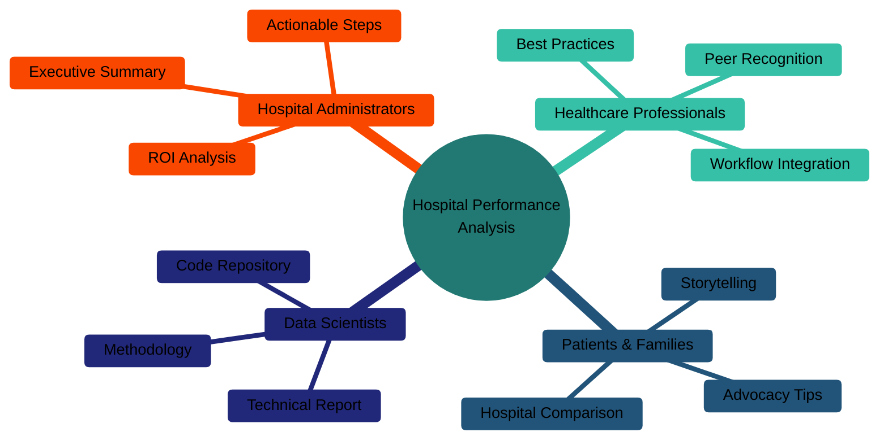

# Communication Strategy — Making Data Accessible & Actionable

## Overview

This document outlines how we communicate hospital performance insights to drive real-world improvements in patient care, with a focus on medication communication—the lowest-scoring patient experience measure across all hospitals.

---

## Core Message

**The Story:**  
When patients like Robert leave hospitals confused about their medications, they often end up back in the ER. Our data shows a nearly perfect correlation (-0.92) between patient understanding and readmission rates. The solution is actionable and within reach.

**The Evidence:**  
Analysis of 119 quality measures across 4 hospitals in Bradenton-Sarasota reveals an 8-point medication communication gap—the largest performance variation of any patient experience measure.

**The Impact:**  
Better medication communication isn't just about scores. It's about patients leaving confident instead of confused, preventing unnecessary ER visits, and improving health outcomes.

---

## Target Audiences

### 1. 🏥 Hospital Administrators & Quality Improvement Teams

**What They Need:**
- Evidence-based performance benchmarking
- Actionable recommendations with clear ROI
- Comparative analysis showing peer performance
- Statistical validation of findings

**How We Reach Them:**
- Executive summary (1-page PDF)
- Technical report with methodology
- Interactive visualizations for presentations
- Direct outreach to quality improvement departments

**Key Message:**  
"Medication communication is your highest-ROI improvement opportunity. The 8-point gap is closable with standardized protocols."

**Call to Action:**
1. Review your hospital's medication discharge process
2. Implement pharmacist-led counseling
3. Adopt visual medication schedules
4. Learn from Sarasota Memorial's best practices

---

### 2. 👨‍⚕️ Healthcare Professionals (Nurses, Pharmacists, Doctors)

**What They Need:**
- Real-world patient stories (like Robert's)
- Recognition of what they're already doing well
- Practical, workflow-integrated solutions
- Peer-validated best practices

**How We Reach Them:**
- Storytelling summary with patient narrative
- Infographics highlighting regional strengths
- Presentation at hospital staff meetings
- Professional networking (LinkedIn posts)

**Key Message:**  
"You excel at communication—nurses and doctors score 87-88 out of 100. Let's extend that excellence to medication education."

**Call to Action:**
1. Take 3 extra minutes at discharge to review medications
2. Use teach-back method ("Can you tell me when you'll take this?")
3. Create visual aids (pill organizers, schedules)
4. Flag high-risk patients for pharmacist review

---

### 3. 👪 Patients & Family Members

**What They Need:**
- Empowerment to advocate for themselves
- Understanding of hospital choices
- Practical tips for discharge preparation
- Reassurance that confusion is common and fixable

**How We Reach Them:**
- Accessible storytelling summary (Robert's story)
- Social media posts (LinkedIn, Facebook community groups)
- Patient advocacy organizations
- Local news/community publications

**Key Message:**  
"You have choices. This data helps you pick hospitals that excel in areas that matter to you—and shows you how to advocate for clear medication instructions."

**Call to Action:**
1. Ask for pharmacist review before leaving the hospital
2. Request written instructions with pictures
3. Bring a family member to your discharge appointment
4. Don't leave until you understand ALL your medications

---

### 4. 📊 Data Science & Healthcare IT Community

**What They Need:**
- Transparent methodology
- Reproducible analysis
- Technical details and code
- Portfolio-quality demonstration of skills

**How We Reach Them:**
- GitHub repository with full code and documentation
- Technical README with statistical details
- Jupyter notebooks showing analysis process
- LinkedIn articles about project journey

**Key Message:**  
"Healthcare data science in action: using publicly available CMS data to drive real-world patient care improvements."

**Call to Action:**
1. Star/fork the GitHub repository
2. Provide feedback on methodology
3. Suggest additional analyses or improvements
4. Share with healthcare data science networks

---

## Communication Channels

### Digital Platforms

**GitHub Repository** (Primary Hub)
- Main storytelling README (Robert's story)
- Technical README (methodology)
- Interactive visualizations (HTML files)
- Complete code and data pipeline
- Documentation and reflections

**Interactive Visualizations** (GitHub Pages)
- Overall hospital comparison
- Top 5 strengths / Bottom 5 opportunities
- Correlation heatmap
- Performance treemap
- All shareable via direct links

**LinkedIn** (Professional Network)
- Project announcement post
- Key findings infographic
- Personal reflection on learning journey
- Engage with healthcare quality improvement groups

**Portfolio Website**
- Case study format
- Before/after problem-solving narrative
- Impact metrics and outcomes
- Link to full GitHub repository

---

### Direct Outreach

**Hospital Quality Improvement Departments**
- Email executive summary + link to full analysis
- Offer to present findings at quality meetings
- Propose collaboration on improvement initiatives

**Local Healthcare Organizations**
- Bradenton-Sarasota Medical Alliance
- Florida Hospital Association
- Patient advocacy groups
- Community health forums

**Academic & Professional Networks**
- MIT Emerging Talent community
- Healthcare data science forums
- Public health conferences
- Medical informatics associations

---

## Storytelling Framework

### The Hook: Robert's Story
Start with a relatable patient narrative that immediately shows human impact:

> *"Robert is 68. Three days after heart surgery, he was back in the ER—confused about his 7 new medications. The data shows why this happens, and how to prevent it."*

### The Evidence: Data-Driven Insights
Present clear, visual evidence that validates the story:
- 69.8/100 medication communication score (lowest measure)
- -0.92 correlation with readmissions (nearly perfect)
- 8-point performance gap (actionable opportunity)

### The Impact: What This Means
Translate statistics into real-world outcomes:
- Fewer ER readmissions
- Better patient confidence
- Improved health outcomes
- Cost savings for hospitals and patients

### The Action: What To Do Next
Provide specific, achievable steps for each audience:
- Patients: Advocate for yourself
- Hospitals: Implement protocols
- Professionals: Extend communication excellence
- Community: Share and amplify

---

## Visual Communication Strategy

### Color Coding & Consistency
- **Green (✅):** Strengths / Best practices
- **Yellow/Orange (⚠️):** Opportunities for improvement
- **Red:** Critical gaps requiring immediate attention
- **Blue:** Neutral data presentation

### Data Visualization Principles
1. **Simple first:** Start with overall comparisons
2. **Layer complexity:** Progress to correlations and details
3. **Interactive where valuable:** Allow exploration
4. **Static for accessibility:** Ensure all can view
5. **Consistent branding:** Hospital colors throughout

### Key Visuals Created
1. **Overall Comparison** — Bar chart showing hospital rankings
2. **Top 5 Strengths** — What the region does well
3. **Bottom 5 Opportunities** — Where improvement is needed
4. **Treemap** — Hierarchical performance view
5. **Correlation Heatmap** — Statistical relationships

---

## Success Metrics

### Short-Term (0-3 Months)
- ✅ GitHub repository stars/forks
- ✅ LinkedIn post engagement (likes, shares, comments)
- ✅ Direct inquiries from hospital quality teams
- ✅ Project included in professional portfolio

### Medium-Term (3-6 Months)
- ✅ One or more hospitals implement recommendations
- ✅ Invitation to present at hospital quality meeting
- ✅ Feature in local healthcare publication
- ✅ Connections with healthcare data professionals

### Long-Term (6-12 Months)
- ✅ Measurable improvement in medication communication scores
- ✅ Reduced readmission rates at participating hospitals
- ✅ Expansion to additional hospitals or regions
- ✅ Recognition in healthcare quality improvement community

---

## Key Messages by Format

### Executive Summary (1 Page)
**For:** Hospital administrators, board members  
**Focus:** Performance benchmarking, ROI, actionable recommendations  
**Tone:** Professional, data-driven, solution-oriented

### Storytelling Summary (2-3 Pages)
**For:** General audience, patients, community members  
**Focus:** Robert's story, human impact, empowerment  
**Tone:** Accessible, empathetic, actionable

### Technical Report (Full Analysis)
**For:** Data scientists, researchers, quality improvement analysts  
**Focus:** Methodology, statistical validation, reproducibility  
**Tone:** Academic, detailed, transparent

### Interactive Visualizations
**For:** All audiences (different entry points)  
**Focus:** Exploration, comparison, insight discovery  
**Tone:** Clear, intuitive, visually engaging

---

## Ethical Considerations

### Patient Privacy
- ✅ Used only publicly available, de-identified data
- ✅ Robert's story is illustrative, not based on specific patient records
- ✅ No PHI (Protected Health Information) included

### Data Transparency
- ✅ All data sources clearly cited (CMS, Florida Health Finder)
- ✅ Time period specified (Oct 2023 - Sep 2024)
- ✅ Limitations acknowledged
- ✅ Methods fully documented for reproducibility

### Balanced Reporting
- ✅ Highlight strengths and opportunities equally
- ✅ Avoid sensationalism or blame
- ✅ Focus on improvement, not criticism
- ✅ Recognize all hospitals serve their communities

### Intellectual Property
- ✅ Code released under MIT License
- ✅ Data subject to CMS terms of use
- ✅ Proper attribution of all sources
- ✅ Respect for hospital branding/trademarks

---

## Distribution Timeline

### Week 1-2: Final Preparation
- ✅ Finalize all reports and visualizations
- ✅ Create slide deck for presentation
- ✅ Record video walkthrough (2.5 minutes)
- ✅ Push final version to GitHub

### Week 3-4: Initial Launch
- Share on LinkedIn with project announcement
- Email executive summary to hospital quality departments
- Post in MIT Emerging Talent community
- Share in healthcare data science forums

### Month 2-3: Follow-Up Engagement
- Respond to questions and feedback
- Offer to present findings at interested organizations
- Write LinkedIn article about project journey
- Connect with healthcare quality improvement professionals

### Month 4+: Ongoing Impact
- Track if hospitals implement recommendations
- Update analysis with new data (if available)
- Share success stories and outcomes
- Expand to comparative analysis with state/national benchmarks

---

## Call to Action Matrix

| Audience | Primary CTA | Secondary CTA |
|----------|-------------|---------------|
| **Hospital Administrators** | Review your medication discharge process | Schedule presentation with quality team |
| **Healthcare Professionals** | Extend communication excellence to medications | Share best practices with peers |
| **Patients & Families** | Advocate for clear medication instructions | Share your story |
| **Data Scientists** | Star/fork GitHub repository | Provide methodology feedback |
| **Community Members** | Share with healthcare workers you know | Support patient education initiatives |

---

## Contact & Collaboration

**Open to:**
- Presenting findings to hospital quality teams
- Collaborating on follow-up analyses
- Sharing methodology with other researchers
- Consulting on healthcare data projects

**Reach Out:**
- GitHub: [@mr-glucose](https://github.com/mr-glucose)
- LinkedIn: [arthur-dorvil](https://www.linkedin.com/in/lens-marc-arthur-dorvil)
- Email: Open an issue in the repository

---

## Final Reflection

**Why This Communication Strategy Matters:**

Data without communication is just numbers in a spreadsheet. This project demonstrates that **effective data science is 50% analysis and 50% storytelling**. By meeting each audience where they are—with the right message, the right format, and the right tone—we transform insights into action.

Robert's story isn't unique. The medication communication gap isn't unsolvable. The correlation between patient understanding and readmissions isn't surprising.

**What matters is whether this data reaches the people who can act on it.**

That's the goal of this communication strategy: to turn analysis into impact, data into decisions, and insights into improvements that help real patients like Robert leave hospitals confident instead of confused.

---

*"The best data analysis in the world means nothing if it can't be understood and acted upon. Communication is the bridge between insight and impact."*

— Arthur Dorvil, MIT Emerging Talent (ET6)

---

**Last Updated:** November 2025  
**Next Review:** After initial distribution (December 2025)
