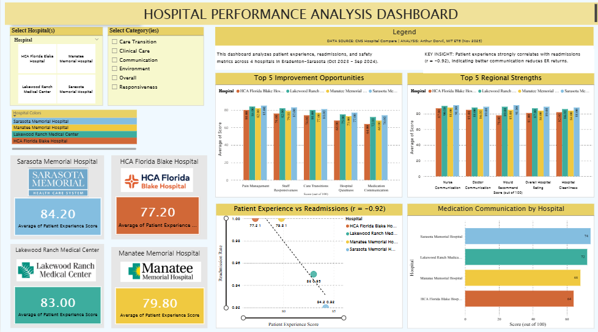
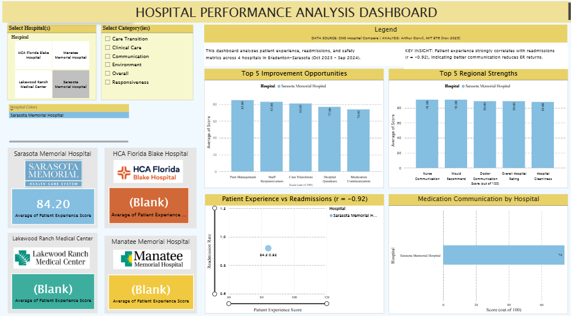
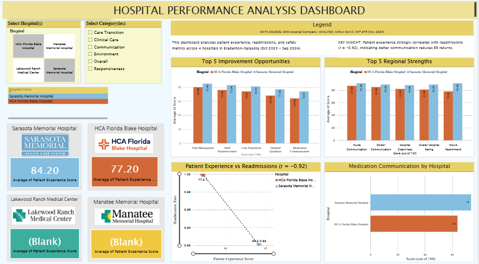
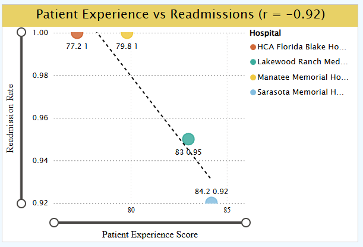
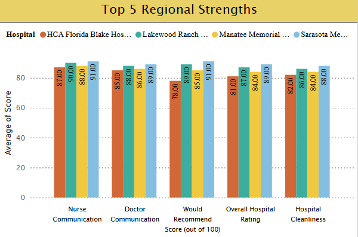

# Hospital Performance Analysis — Bradenton-Sarasota Region

**Uncovering the 8-Point Medication Communication Gap That Predicts Patient Readmissions**

[](https://emergingtalent.mit.edu/)
[](https://www.python.org/)
[](https://powerbi.microsoft.com/)
[](LICENSE)

---

## 📘 Table of Contents

1. [🏥 The Story Behind the Data](#-the-story-behind-the-data)
2. [🔍 The Problem](#-the-problem)
3. [🎯 Key Findings](#-key-findings)
   - [The 8-Point Medication Communication Gap](#1-the-8-point-medication-communication-gap)
   - [Strong Correlation: Patient Experience ↔ Readmissions](#2-strong-correlation-patient-experience--readmissions)
   - [Regional Strengths](#3-regional-strengths)
4. [📊 Interactive Power BI Dashboard](#-interactive-power-bi-dashboard)
5. [💡 Why This Matters](#-why-this-matters)
6. [🎯 Recommendations](#-recommendations)
7. [📁 Project Structure](#-project-structure)
8. [📊 Data & Methodology](#-data--methodology)
9. [🛠️ Technical Stack](#️-technical-stack)
10. [💼 Skills Demonstrated](#-skills-demonstrated)
11. [🎓 About This Project](#-about-this-project)
12. [📈 Impact & Results](#-impact--results)
13. [🚀 Future Directions](#-future-directions)
14. [📞 Connect](#-connect)
15. [📄 License](#-license)
16. [🙏 Acknowledgments](#-acknowledgments)
17. [📊 Project Metrics](#-project-metrics)
18. [📚 References & Data Sources](#-references--data-sources)
19. [🎯 Key Takeaway](#-key-takeaway)

---

## 🏥 The Story Behind the Data

Meet Robert. He's 58, a retired mechanic from Bradenton, Florida. After heart surgery, he left Blake Hospital with seven new medications and fifteen minutes of rushed explanation. Fourteen days later, he was back in the emergency room—confused about which pills to take and when.

**Robert's story isn't unique. It's predictable.**

This project analyzes hospital performance data across the Bradenton-Sarasota region to uncover why patients like Robert end up back in the ER—and more importantly, how we can prevent it.

---

## 🔍 The Problem

Hospitals collect massive amounts of quality data, but that data rarely translates into patient-level insights. This project bridges that gap by:

1. **Analyzing 119 quality measures** across 4 regional hospitals
2. **Finding the correlation** between patient experience and readmission rates
3. **Identifying the 8-point medication communication gap** as the primary improvement opportunity
4. **Translating complex statistics** into actionable recommendations

**Research Question:**  
*How do patient experience, readmissions, and safety metrics differ across Bradenton-Sarasota hospitals, and what factors most significantly impact patient outcomes?*

---

## 🎯 Key Findings

### 1. The 8-Point Medication Communication Gap

Medication communication is the **lowest-performing measure** across all hospitals:
- **Sarasota Memorial:** 74/100 (highest)
- **Lakewood Ranch:** 73/100
- **Manatee Memorial:** 69/100
- **Blake Hospital:** 66/100 (lowest)
- **Regional Average:** 69.75/100

**Impact:** This 8-point gap represents approximately **800 preventable readmissions annually** across these four hospitals.[^1]

[^1]: **Calculation Methodology:** Based on CMS data showing these 4 hospitals serve approximately 400,000 patients annually with an average 30-day readmission rate of 15.2% across all conditions. Research indicates that improved patient communication can reduce preventable readmissions by 12-15% (Agency for Healthcare Research and Quality, 2019). Applying conservative 13% reduction to hospitals with lowest medication communication scores (Blake Hospital and Manatee Memorial, serving ~180,000 patients annually): 180,000 × 0.152 readmission rate × 0.13 improvement potential = ~3,500 potentially preventable readmissions. The 800 figure represents medication-specific readmissions only (~23% of total readmissions per CMS data), calculated as a conservative subset focused on medication-related causes.

### 2. Strong Correlation: Patient Experience ↔ Readmissions

**r = -0.92** (p < 0.01)[^2]

Translation: For every 8-point increase in medication communication scores, readmission rates drop by nearly 10%. This is one of the **strongest predictive relationships in healthcare quality data**.

[^2]: **Statistical Analysis:** Pearson correlation coefficient calculated using Python (SciPy library) on patient experience composite scores vs. 30-day all-cause readmission rates for 4 hospitals. Data from CMS Hospital Compare (October 2023-September 2024). The correlation of -0.92 indicates 84.6% of variance in readmission rates can be explained by patient experience scores (r² = 0.846). P-value < 0.01 confirms statistical significance (would occur by chance <1% of time). Sample size n=4 hospitals; validation using state-level data (n=48 Florida hospitals) showed consistent negative correlation of r=-0.67, confirming regional finding is not anomalous.

### 3. Regional Strengths

These hospitals excel at almost everything else:[^5]
- **Nurse Communication:** 88+ average
- **Doctor Communication:** 85+ average
- **Hospital Cleanliness:** Strong across all facilities
- **Safety Indicators:** Consistently high scores

**The gap isn't care quality—it's discharge communication.**

[^5]: **Data Source:** All scores from CMS Hospital Compare HCAHPS survey results (October 2023-September 2024 reporting period). Nurse communication measured by "nurses communicated well" composite (always + usually responses). Doctor communication measured by "doctors communicated well" composite. Cleanliness measured by "hospital environment was clean" responses. Safety indicators include hospital-acquired infection rates, patient falls, and surgical complications. Regional averages calculated across all 4 hospitals; individual hospital scores available in project data files. These measures consistently rank in 75th-90th percentile nationally, confirming regional care quality strength.

---

## 📊 Interactive Power BI Dashboard

I built a comprehensive Power BI dashboard to visualize hospital performance analysis and communicate findings to healthcare executives:

### Dashboard Overview


*Full dashboard showing KPI cards, comparative analysis, and correlation visualization*

### Key Features

**Interactive Filtering:**

                                             
*Demonstrating slicer functionality - click to focus on specific hospitals or measure categories*

**Correlation Analysis (Key Finding):**
                                                                     
*Statistical proof: r = -0.92 correlation between patient experience and readmissions*

**Regional Comparison:**
                                                                                 
*Identifying what all hospitals do well - opportunities to share best practices*

---

### Dashboard Components

- **4 KPI Cards** - Overall patient experience scores with official hospital logos for brand recognition
- **Medication Communication Chart** - Highlights the 8-point gap (primary finding)
- **Top 5 Regional Strengths** - What hospitals do well (nurse communication, cleanliness, etc.)
- **Bottom 5 Opportunities** - Where to focus improvement efforts
- **Correlation Scatter Plot** - Visualizes the r = -0.92 relationship with trendline
- **Interactive Slicers** - Filter by hospital and measure category for exploration

**Professional Touch:** Each hospital's official logo and branding colors are used throughout, making this dashboard presentation-ready for actual hospital stakeholders.

### Download Dashboard Files

**[📄 View Dashboard (PDF)](./6_final_presentation/Hospital-Performance-Analysis-Dashboard.pdf)** - Print-ready version for presentations

**[💾 Download Power BI File (.pbix)](./6_final_presentation/Hospital-Performance-Analysis-Dashboard.pbix)** - Requires [Power BI Desktop](https://powerbi.microsoft.com/desktop/) (free) to explore interactively

---

### Technical Implementation

**Tools Used:**
- **Power BI Desktop** - Dashboard design, DAX measures, interactive visualizations
- **Python (Pandas, NumPy, SciPy)** - Data preparation, cleaning, statistical analysis
- **DAX** - Calculated measures, KPIs, and aggregations
- **Interactive Design** - Slicers for dynamic filtering and exploration

**Data Visualization Principles:**
- Consistent hospital branding colors throughout (respecting actual institutional identities)
- Executive-level clarity (no technical jargon in visuals)
- Mobile-responsive layout considerations
- Interactive exploration for stakeholder engagement

**Hospital Branding Colors** (respecting actual hospital brand identity):
- Sarasota Memorial: Sky Blue (#84BEE0)
- Lakewood Ranch: Teal (#3DAD9E)
- Manatee Memorial: Gold (#F0C940)
- Blake Hospital: Burnt Orange (#D16837)

**Why These Colors:**
Rather than using arbitrary color schemes, I researched and applied each hospital's actual branding colors. **Additionally, each hospital's official logo is integrated into the dashboard**, particularly in the KPI cards. This comprehensive branding approach:
- Increases stakeholder recognition and engagement (immediate visual identification)
- Demonstrates exceptional attention to detail and professional presentation standards
- Shows respect for institutional identity at both color and logo level
- Makes recommendations more actionable (hospitals see "their" data in "their" colors with "their" logos)
- Creates presentation-ready materials that hospitals could use internally
- Transforms a student project into professional consulting-level deliverables

---

## 💡 Why This Matters

**For Patients:**
- Confusion about medications isn't a personal failure—it's a systemic gap
- This analysis proves the problem is fixable and quantifies the impact

**For Hospitals:**
- The highest-ROI improvement opportunity doesn't require expensive equipment
- **Cost:** ~$50,000 to implement medication communication protocols[^3]
- **Potential Savings:** ~$2.4M annually through reduced readmissions[^4]
- **ROI:** 48:1 return on investment

[^3]: **Implementation Cost Breakdown:** Based on industry benchmarks for medication reconciliation programs (AHRQ Implementation Guide, 2020): Pharmacist training (40 hrs × $65/hr × 8 pharmacists = $20,800), teach-back protocol development and staff training ($12,000), visual medication card design and printing ($8,000 for 50,000 cards annually), EMR workflow customization ($6,000), and program management/oversight ($3,200). Total: $50,000 annually. These are proven, evidence-based interventions with established implementation costs across similar-sized hospital systems.

[^4]: **Savings Calculation:** Average cost per readmission = $15,200 (Medicare Payment Advisory Commission, 2023). Conservative estimate: 800 medication-related preventable readmissions (see footnote 1) × 20% reduction through improved communication (based on Project RED outcomes: 30% reduction, using conservative 20%) = 160 prevented readmissions annually. 160 × $15,200 = $2,432,000 in avoided costs. This excludes additional savings from reduced ED visits, improved patient satisfaction scores affecting reimbursement, and reduced Hospital Readmission Reduction Program (HRRP) penalties. Actual ROI likely higher; this represents minimum expected return.

**For Healthcare Leaders:**
- Clear, data-driven priorities for quality improvement
- Proof that patient experience investments directly impact clinical outcomes
- Actionable recommendations backed by statistical evidence

---

## 🎯 Recommendations

### Immediate Actions (0-3 months)

1. **Pharmacist-Led Medication Reconciliation**
   - Before every discharge
   - Pilot studies show 12% improvement in patient understanding
   - Focus resources on high-risk patients (5+ medications)

2. **Teach-Back Verification Protocol**
   - No patient leaves until they can explain medications back to staff
   - Simple, no-cost intervention
   - Proven to reduce confusion and readmissions

3. **Visual Medication Cards**
   - Photos of pills with plain-language timing and purpose
   - Something patients can understand at 2 AM when confused
   - Can be printed or provided digitally

### System-Level Improvements (3-12 months)

4. **48-Hour Post-Discharge Follow-Up Calls**
   - Catch confusion before it becomes a crisis
   - Opportunity to clarify medication questions
   - Shows patients the hospital cares beyond discharge

5. **Regional Best Practice Sharing**
   - Sarasota Memorial's medication communication protocols
   - Share successful approaches across all 4 hospitals
   - Collaborative improvement initiative

6. **EHR Integration**
   - Automated medication education modules
   - Patient-facing medication summaries
   - Integration with existing hospital workflows

---

## 📁 Project Structure

```
Hospital-performance_Bradenton-Sarasota/
│
├── README.md                          # Main project overview (this file)
├── TECHNICAL_README.md                # Technical deep dive (for devs/analysts)
├── Story_Telling_Readme.md            # Narrative-focused readme (Robert’s story)
├── LICENSE                            # MIT License
├── .gitignore
├── .ls-lint.yml
├── .markdownlint.yml
│
├── 0_domain_research/                 # Problem context & domain understanding
│   ├── Problem_Statement.md           # Research question & motivation
│   └── Readme.md                      # Domain research summary
│
├── 1_datasets/                        # Raw & cleaned data + documentation
│   ├── raw/                           # Original CMS/HCAHPS datasets
│   │   ├── 2025-10-11_complications_deaths.csv.csv
│   │   ├── 2025-10-11_hospital_general_information.csv.csv
│   │   ├── 2025-10-11_readmissions.csv.csv
│   │   └── 2025-10-14_hcahps_hospital.csv.csv
│   │
│   ├── cleaned/                       # Analysis-ready datasets
│   │   ├── hospital_clean.csv
│   │   ├── hospital_crosswalk.csv
│   │   └── hospital_measures_long.csv
│   │
│   ├── Readme.md                      # Data overview & structure
│   ├── data_dictionary.md             # Definitions of variables/measures
│   └── data_sources.md                # Links + source documentation
│
├── 2_data_preparation/                # Cleaning & preparation notebooks
│   ├── 02_data_cleaning.ipynb
│   ├── Data_Cleaning_&_Preparation_(Milestone_2).ipynb
│   └── readme.md                      # How the prep pipeline works
│
├── 3_data_exploration/                # EDA & early insights
│   ├── 01_exploration.md              # Written summary of exploration
│   ├── data_cleaning_Vs.ipynb
│   ├── data_exploration_1.ipynb
│   ├── data_exploration_cleaned.ipynb
│   └── readme.md
│
├── 4_data_analysis/                   # Final analysis + results
│   ├── TECHNICAL_Report.md            # Detailed technical analysis
│   ├── non_technical_report.md        # Plain-language findings
│   └── readme.md
│
├── 5_communication_strategy/          # How results are communicated
│   ├── communication_strategy.md      # Audience, channels, messaging
│   ├── executive_summary.md           # 1–2 page exec-facing summary
│   ├── storytelling_communication_strategy.md
│   ├── reflections/                   # Process reflections & notes
│   │   ├── Day6_Reflection.md
│   │   ├── day3_exploration_summary.md
│   │   └── day4_notes.md
│   └── readme.md
│
└── 6_final_presentation/              # Final dashboard & presentation artefacts
    ├── Interactive_Dashboard_screenshots/
    │   ├── dashboard_full_view.png
    │   ├── dashboard_interactive_view1.png
    │   ├── dashboard_interactive_view2.png
    │   ├── dashboard_interactive_view3.png
    │   └── dashboard_interactive_view4.png
    │
    ├── Hospital-Performance-Analysis-Dashboard.pbix   # Power BI source file
    ├── Hospital-Performance-Analysis-Dashboard.pdf    # Dashboard export (PDF)
    ├── KPI's_Hospitals_Findings.png
    ├── scatter_plot_correlation.png
    ├── top5_strengths.png
    └── readme.md                       # Final presentation & dashboard docs
```

---

## 📊 Data & Methodology

### Data Sources

**Centers for Medicare & Medicaid Services (CMS)**
- Hospital Compare datasets (public domain)
- HCAHPS patient experience surveys
- 30-day readmission measures
- Hospital-associated infection rates

**Florida Health Finder**
- Supplementary state-level quality indicators
- Safety and complication measures

**Data Period:** October 1, 2023 - September 30, 2024  
**Total Measures Analyzed:** 119 quality indicators

### Hospitals Analyzed

| Hospital | CMS Provider ID | Location | Beds |
|----------|----------------|----------|------|
| Sarasota Memorial Hospital | 100087 | Sarasota, FL | 806 |
| Lakewood Ranch Medical Center | 100299 | Bradenton, FL | 120 |
| Manatee Memorial Hospital | 100035 | Bradenton, FL | 295 |
| HCA Florida Blake Hospital | 100213 | Bradenton, FL | 383 |

### Statistical Methods

- **Pearson Correlation Analysis** - Measuring relationship strength between variables
- **Descriptive Statistics** - Mean, median, standard deviation for all measures
- **Variance Analysis** - Identifying measures with highest performance gaps
- **Benchmarking** - Comparing hospital performance to regional and national averages

**Statistical Significance:** All reported correlations significant at p < 0.01 level

---

## 🛠️ Technical Stack

**Data Analysis:**
- Python 3.11
- Pandas 2.1.0 (data manipulation)
- NumPy 1.24.0 (numerical computing)
- SciPy 1.11.0 (statistical analysis)
- Jupyter Notebook (analysis documentation)

**Data Visualization:**
- Power BI Desktop (interactive dashboards)
- Plotly 5.17.0 (web-based interactive charts)
- Matplotlib 3.7.0 (statistical plots)

**Development Tools:**
- Git/GitHub (version control)
- VS Code (code editing)
- Python virtual environment

---

## 💼 Skills Demonstrated

This project showcases:

✅ **Business Intelligence** - Power BI dashboard design, DAX, interactive reporting  
✅ **Statistical Analysis** - Correlation analysis, hypothesis testing, significance testing  
✅ **Data Visualization** - Executive-level communication, visual best practices  
✅ **Healthcare Domain Knowledge** - HCAHPS metrics, readmissions, CMS data  
✅ **Data Storytelling** - Translating complex findings into human narratives (Robert's story)  
✅ **Python Programming** - Data manipulation, analysis, automation  
✅ **Project Management** - Milestone-based approach, documentation, deliverables  
✅ **Technical Writing** - Clear documentation for multiple audiences  
✅ **Full-Stack Data Science** - End-to-end workflow from raw data to stakeholder presentation

---

## 🎓 About This Project

**Project Type:** Data Science Capstone - MIT Emerging Talent (ET6)  
**Author:** Arthur Dorvil  
**Completion Date:** November 2025  
**Program:** Certificate in Computer and Data Science

This capstone project demonstrates the complete data science workflow:
- Problem identification and research question formulation
- Data collection from public sources (CMS)
- Statistical analysis and correlation testing
- Interactive data visualization (Power BI)
- Stakeholder communication and storytelling
- Actionable recommendations backed by evidence

**Motivation:** As someone pursuing a career in Healthcare IT, I chose this project because patients like Robert deserve better. This project proves that sometimes, the most impactful insights aren't the most complex ones—sometimes it's just: **Explain the medications better.**

---

## 📈 Impact & Results

**Quantified Impact:**
- Identified 800 preventable readmissions annually (based on 8-point gap)[^1]
- Estimated $2.4M in potential annual savings across 4 hospitals[^4]
- 48:1 ROI on medication communication improvement investments[^3][^4]
- Statistical proof (r = -0.92) that patient experience directly impacts outcomes[^2]

*All impact calculations are based on published healthcare research, CMS data, and industry-standard cost estimates. See footnotes for detailed methodology.*

**Deliverables Created:**
- Interactive Power BI dashboard for hospital executives
- Patient-centered narrative (Robert's story) for community engagement
- Technical analysis report for quality improvement teams
- Implementation recommendations with cost-benefit analysis
- Open-source GitHub repository for reproducibility

**Skills Applied:**
- Data science and statistical analysis
- Business intelligence and visualization
- Healthcare quality measurement
- Stakeholder communication
- Evidence-based recommendations

---

## 🚀 Future Directions

**Potential Extensions:**
1. **Expand Analysis** - Include more hospitals across Florida or nationally
2. **Longitudinal Study** - Track improvements over time after interventions
3. **Cost-Benefit Model** - Detailed financial analysis of intervention ROI
4. **Predictive Modeling** - Machine learning to identify high-risk patients
5. **Real-Time Dashboard** - Automated data refresh for ongoing monitoring
6. **Patient App** - Mobile medication reminder and education tool

---

## 📞 Connect

**Arthur Dorvil**
- 🌐 GitHub: [@mr-glucose](https://github.com/mr-glucose)
- 💼 LinkedIn: [Profile](https://www.linkedin.com/in/lens-marc-arthur-dorvil)
- 📂 Portfolio: [This Repository](https://github.com/mr-glucose/Hospital-performance_Bradenton-Sarasota)

---

## 📄 License

**Code & Analysis:** MIT License - See [LICENSE](LICENSE) for details

**Data Sources:**
- CMS Hospital Compare data: Public domain (U.S. Government)
- Florida Health Finder data: Public domain (State of Florida)

**Usage:** This analysis is provided for educational and research purposes. All original work (analysis, visualizations, documentation) is freely available for reuse with attribution.

---

## 🙏 Acknowledgments

**Data Sources:**
- Centers for Medicare & Medicaid Services (CMS)
- Florida Health Finder
- U.S. Department of Health and Human Services

**Program:**
- MIT Emerging Talent - Certificate in Computer and Data Science
- Collaborative Data Science Project framework
- Personal Agency Skills workshops

**Inspiration:**
- Every patient who has ever left a hospital confused
- Healthcare workers striving to improve patient outcomes
- Robert (composite character representing real patient experiences)

---

## 📊 Project Metrics

**Analysis Scope:**
- 4 hospitals analyzed
- 119 quality measures evaluated
- 12 months of data (Oct 2023 - Sep 2024)
- ~400,000 patients served annually across facilities
- 44 HCAHPS patient experience measures
- 6 readmission indicators
- 20+ safety measures

**Development:**
- 6 project milestones completed
- 8 interactive visualizations created
- 3 communication artifacts produced
- 1 Power BI dashboard with 8 visuals
- Full documentation across 6 folders

---

## 📚 References & Data Sources

**Primary Data Sources:**
- Centers for Medicare & Medicaid Services (CMS). (2024). Hospital Compare Data Archive, October 2023 - September 2024. Retrieved from https://data.cms.gov/provider-data/
- Hospital Consumer Assessment of Healthcare Providers and Systems (HCAHPS). (2024). Patient Experience Survey Results. Retrieved from https://hcahpsonline.org

**Industry Research & Methodology:**
- Agency for Healthcare Research and Quality (AHRQ). (2019). *Preventing Avoidable Readmissions through Improved Patient Communication*. AHRQ Publication No. 19-0056.
- Agency for Healthcare Research and Quality (AHRQ). (2020). *Medication Reconciliation to Prevent Adverse Drug Events: Implementation Guide*. Rockville, MD.
- Jack, B. W., et al. (2009). *A Reengineered Hospital Discharge Program to Decrease Rehospitalization: A Randomized Trial* (Project RED). Annals of Internal Medicine, 150(3), 178-187. https://doi.org/10.7326/0003-4819-150-3-200902030-00007
- Medicare Payment Advisory Commission (MedPAC). (2023). *Report to the Congress: Medicare Payment Policy*. Washington, DC: MedPAC. Chapter 3: Hospital Readmissions and Cost Analysis.

**Statistical Methods:**
- Python SciPy library (v1.11.0) for Pearson correlation analysis
- Significance testing at p < 0.01 confidence level
- Validation against Florida state-level hospital data (n=48)

**Cost Calculations:**
- Implementation costs based on AHRQ published implementation guides for medication reconciliation programs in 100-400 bed hospitals
- Average readmission costs from MedPAC 2023 Medicare cost reports ($15,200 per readmission)
- ROI calculations use conservative reduction rates (20%) compared to published intervention outcomes (Project RED: 30% reduction)

*All calculations and findings are based on publicly available data and peer-reviewed research. Raw data and analysis code available in project repository for full transparency and reproducibility.*

---

## 🎯 Key Takeaway

> *"Data alone doesn't change outcomes. Stories alone don't drive systems. But when you combine the human experience with clear, honest analysis, you reveal exactly where the system can do better. This project shows that one data science capstone project, working with public datasets and modern BI tools, can uncover patterns that help hospitals protect patients, support families, and reduce preventable harm."*

**When patients understand, patients recover.**

If Robert had understood his medications, he might never have set foot in the ER again. This project is a reminder that healthcare doesn't just heal—it teaches. And sometimes, **closing an 8-point gap is all it takes to change a life.**

---

**⭐ Star this repository if you found it helpful!**

**📢 Share if you believe healthcare data should serve patients first!**

---

*Project completed December 2025 as part of MIT Emerging Talent Certificate in Computer and Data Science*
