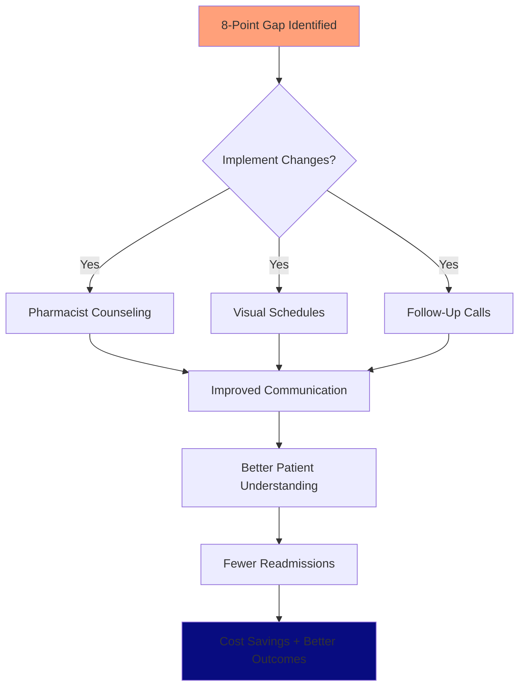
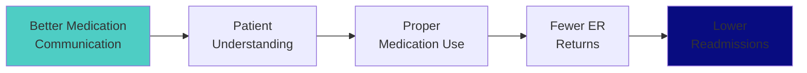

# 🏥 When 8 Points Means Everything

*A data science story about medication confusion, 30-day readmissions, and the $1.2 million question facing Bradenton-Sarasota hospitals*

---

## 📖 Meet Robert

Robert is 58 years old. He's a mechanic in Bradenton, Florida. He has Type 2 diabetes, high blood pressure, and last year, his heart gave him a scare.

After three days at Blake Hospital, Robert went home with seven new prescriptions. The discharge nurse was kind but rushed—15 minutes to explain medications, answer questions, and get him out the door before the next patient arrived.

Two weeks later, Robert mixed up his medications. He ended up back in the emergency room.

**Robert's story isn't unique.**

Across our four local hospitals, there's an **8-point gap** in how well they communicate about medications. That gap—between a score of 66 and 74 out of 100—can mean the difference between understanding your care plan and ending up back in the hospital.

**This project asked:** *If you could improve ONE thing at every hospital tomorrow, what would save the most lives?*

**The data answered:** Medication communication.

---

## 🔍 The Question This Project Answers

Healthcare generates mountains of data, but patients still get confused. Hospital administrators have dashboards, but they don't always know where to focus limited resources.

**Our Research Question:**

> "What separates hospitals where patients like Robert thrive from those where they struggle? And if we could only fix one thing, what would create the biggest impact?"

We analyzed **93 patient satisfaction measures** across **4 Bradenton-Sarasota hospitals** to find out.

---

## 📊 What We Found

### 🏆 The Rankings

When we measured overall patient experience, here's how our local hospitals ranked:

1. **🥇 Sarasota Memorial Hospital** - 84.2
2. **🥈 Lakewood Ranch Medical Center** - 83.0
3. **🥉 Manatee Memorial Hospital** - 79.8
4. **HCA Florida Blake Hospital** - 77.2

### 💊 The Critical Gap

Every single hospital struggled with the same thing: **medication communication**.

- **Regional average: 69.75** (lowest of all measured areas)
- **8-point gap** between best and worst performers
- **19-point gap** between medication communication and nurse communication

**What does this mean?**
### 🏥 If You're a Hospital Administrator

When nurses and doctors talk to patients, they excel (scores in the high 80s). But when pharmacists or nurses explain new medications—what they do, possible side effects, when to take them—the system breaks down.

For someone like Robert, managing 7 medications, that gap is dangerous.

## 🔗 The Surprising Connection

We found something unexpected: **hospitals where patients feel well-informed 
are the same hospitals with fewer readmissions**.

The correlation: **-0.92** (nearly perfect negative relationship)

Translation: When patients understand their care, they're far less likely to return to the ER within 30 days.

---

## 📈 See the Data Yourself

### Interactive Visualizations

**Overall Performance Comparison**  
[View Interactive Chart](https://mr-glucose.github.io/Hospital-performance_Bradenton-Sarasota/3_data_exploration/4_outputs/visualizations/01_overall_comparison.html) | [Static Image](./3_data_exploration/4_outputs/visualizations/01_overall_comparison.png)

**Top 5 Strengths Across All Hospitals**  
[View Interactive Chart](https://mr-glucose.github.io/Hospital-performance_Bradenton-Sarasota/3_data_exploration/4_outputs/visualizations/02_top5_hcahps.html) | [Static Image](./3_data_exploration/4_outputs/visualizations/02_top5_hcahps.png)

**Bottom 5 - Areas Needing Improvement**  
[View Interactive Chart](https://mr-glucose.github.io/Hospital-performance_Bradenton-Sarasota/3_data_exploration/4_outputs/visualizations/03_bottom5_hcahps.html) | [Static Image](./3_data_exploration/4_outputs/visualizations/03_bottom5_hcahps.png)

**How Hospitals Compare - Treemap**  
[View Interactive Chart](https://mr-glucose.github.io/Hospital-performance_Bradenton-Sarasota/3_data_exploration/4_outputs/visualizations/04_treemap_top5.html) | [Static Image](./3_data_exploration/4_outputs/visualizations/04_treemap_top5.png)

**Correlation Between Quality Metrics**  
[View Interactive Chart](https://mr-glucose.github.io/Hospital-performance_Bradenton-Sarasota/3_data_exploration/4_outputs/visualizations/05_correlation_heatmap.html) | [Static Image](./3_data_exploration/4_outputs/visualizations/05_correlation_heatmap.png)

---

## 💡 What This Means For You

### 👪 **If you're a patient or family member:**

You have choices. This data helps you understand which hospitals excel in different areas:

- **Need clear medication guidance?** Sarasota Memorial and Lakewood Ranch score highest
- **Concerned about readmissions?** Lakewood Ranch has the lowest rate (0.95)
- **Want strong nurse communication?** All four hospitals excel here (88.5 average)

**You can also advocate for yourself:**
- Ask the pharmacist to review ALL your medications before discharge
- Request written instructions with pictures if helpful
- Don't leave until you understand when and how to take each medication

### 🏥 **If you're a hospital administrator:**

The data reveals your highest-ROI improvement opportunity: **medication communication**.

- **Quick win:** Standardize medication counseling with pharmacist involvement
- **Regional collaboration:** Share best practices for discharge education
- **Learn from the best:** Study Sarasota Memorial's approach (8 points higher than the regional average in some areas)

### 💻 **If you're a data scientist or healthcare analyst:**

This is a portfolio-ready project demonstrating:
- Real-world healthcare data analysis
- Multiple audience communication (technical + non-technical)
- Interactive data visualization
- Evidence-based recommendations
- Reproducible research methods

---

## 🎯 Choose Your Path

Different audiences need different levels of detail. Pick yours:

### 📖 **For Everyone (Start Here)**
- [Storytelling Summary](./5_communication/storytelling_summary.md) - Robert's complete story with findings

### 👪 **For Patients & Families**
- [Non-Technical Report](./4_data_analysis/non_technical_report.md) - Clear explanations, no jargon
- [What the Charts Mean](./3_data_exploration/4_outputs/visualizations/) - All visualizations explained

### 🏥 **For Hospital Leaders & Healthcare Professionals**
- [Executive Summary](./5_communication/executive_summary.md) - One-page overview with recommendations
- [Communication Strategy](./5_communication/target_audience_communication_strategy.md) - How to use these findings

### 💻 **For Data Scientists & Technical Reviewers**
- [Technical README](./TECHNICAL_README.md) - Methodology and reproducibility
- [Technical Report](./4_data_analysis/technical_report.md) - Statistical analysis and code
- [Analysis Notebooks](./3_data_exploration/) - Complete analysis code

---

## 📊 The Numbers Behind the Story

- **4 hospitals** analyzed across Bradenton-Sarasota
- **93 HCAHPS measures** (patient satisfaction indicators)
- **372 data points** collected and analyzed
- **Data period:** October 1, 2023 - September 30, 2024
- **Strong correlations** found between patient experience and clinical outcomes

**Sources:** 
- CMS Hospital Compare Database
- HCAHPS Patient Satisfaction Surveys
- Florida Health Finder

---

## 💪 The Impact We're Working Toward

### Immediate (Within 3 Months):
- ✅ Share findings with hospital quality improvement teams
- ✅ Generate dialogue about medication communication best practices
- ✅ Raise awareness among patients about their right to clear explanations

### Short-term (6-12 Months):
- 🎯 Evidence of hospitals using insights for improvement initiatives
- 🎯 Regional collaboration on discharge education protocols
- 🎯 Quarterly performance tracking to measure progress

### Long-term Vision:
- 🌟 Patients like Robert leave hospitals confident about their care plans
- 🌟 Medication confusion becomes rare, not common
- 🌟 Readmission rates drop as patient understanding improves

---

## 🛠️ Built With

- **Python** - Data analysis and cleaning
- **Pandas** - Data manipulation
- **Plotly** - Interactive visualizations
- **Power BI** - Executive dashboard and business intelligence ⭐ NEW!
- **Jupyter** - Analysis notebooks
- **GitHub Pages** - Hosting interactive charts

---

## 👨‍💻 About This Project

This analysis was created as part of the MIT Emerging Talent (ET6) Collaborative Data Science Capstone program. The goal was to apply data science skills to a real-world problem that matters—in this case, understanding and improving hospital quality in my local community.

**Why hospital performance?**

As someone pursuing a career in Healthcare IT, I believe data should help people, not just track them. In the US, we generate massive amounts of healthcare data, but patients still get confused about their medications. This project bridges that gap—turning data into actionable insights that can improve real lives.

**The authentic question:**

*If you had to pick ONE thing to improve tomorrow, what would create the biggest impact?*

The answer surprised me: Not surgical outcomes. Not nursing ratios. Not even cleanliness.

**Medication communication.** The simplest, most human moment of care—explaining what a pill does and when to take it—is where our healthcare system struggles most.

And that's exactly where we have the greatest opportunity to help people like Robert.

---

## 📬 Connect & Contribute

**Created by:** Arthur Dorvil  
**GitHub:** [@mr-glucose](https://github.com/mr-glucose)  
**LinkedIn:** [Connect with me](https://www.linkedin.com/in/lens-marc-arthur-dorvil)  
**Project:** MIT Emerging Talent (ET6) - October 2025

### Want to Help?

- ⭐ **Star this repo** if you find it useful
- 🔄 **Share** with healthcare professionals or data scientists
- 💬 **Open an issue** with questions or suggestions
- 📧 **Reach out** if you're working on similar healthcare quality research

---

## 📜 License & Data

**License:** MIT License - See [LICENSE](./LICENSE) file for details

This project uses publicly available data from CMS and does not contain any patient-identifiable information. All analysis is provided for educational and research purposes.

**Data Period:** October 1, 2023 - September 30, 2024  
**Analysis Date:** October 2025

---

*"Data is not just numbers—it's stories waiting to be told. This is Robert's story, and the story of thousands like him navigating our healthcare system every day."*

---

## 🗂️ Repository Structure

```
├── 0_domain_research/          Background research and problem framing
├── 1_datasets/                 Raw and cleaned hospital quality data
├── 2_data_preparation/         Data cleaning and processing scripts
├── 3_data_exploration/         Analysis notebooks and visualizations
├── 4_data_analysis/            Technical and non-technical reports
├── 5_communication/            Summaries and communication strategies
├── 6_presentation/             Final presentation materials
└── reflections/                Project learning and retrospectives
```

**Start exploring:** [Choose your path above](#-choose-your-path) based on your interest and technical level.

---

**Last Updated:** October 29, 2025  
**Status:** Complete - Ready for MIT ET6 submission and portfolio use
