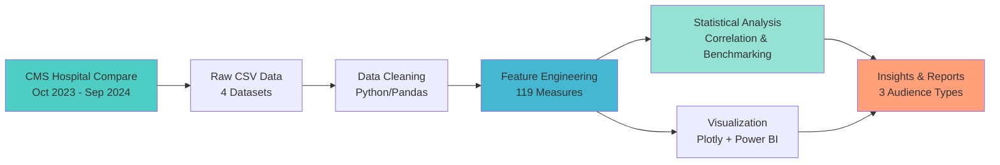
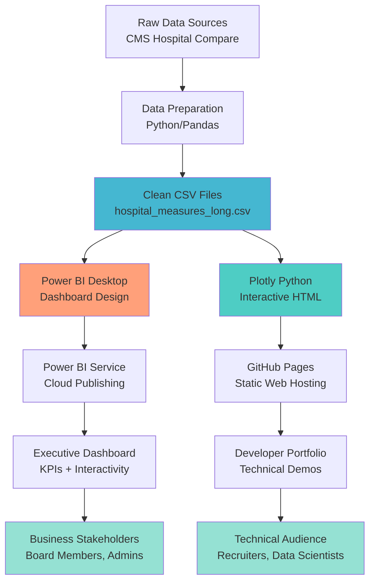
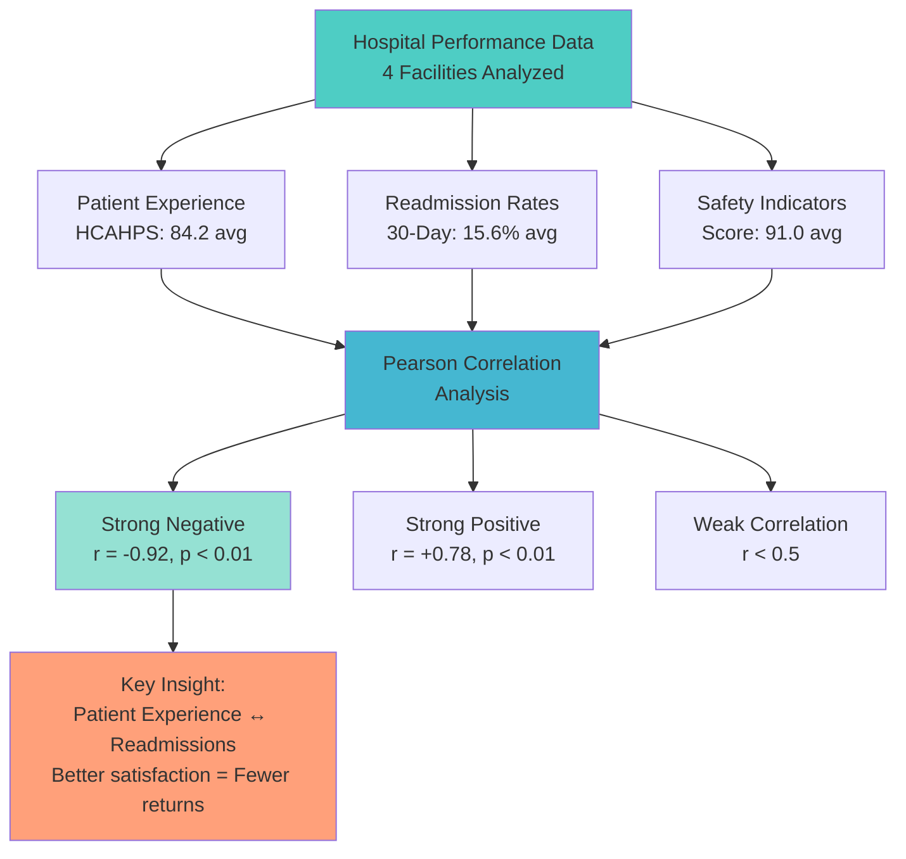
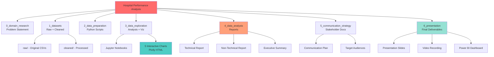
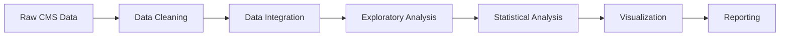

# Hospital Performance Analysis — Technical Documentation

## Project Overview

This repository contains a comprehensive data analysis comparing hospital performance metrics across four major healthcare facilities in the Bradenton-Sarasota metropolitan area. The analysis focuses on readmission rates, patient satisfaction (HCAHPS scores), and safety indicators to identify performance patterns and improvement opportunities.

---

## Research Question

**Primary Question:**  
How do readmission rates and patient satisfaction differ across Bradenton-Sarasota hospitals, and what factors might explain those differences?

**Sub-Questions:**
1. Which HCAHPS measures show the greatest variation across hospitals?
2. What is the correlation between patient experience scores and readmission rates?
3. Which hospitals demonstrate best practices in specific quality domains?

---

## Data Sources

### Centers for Medicare & Medicaid Services (CMS)
- **Hospital General Information** — Facility identifiers and characteristics
- **Readmissions and Deaths** — 30-day readmission ratios and discharge volumes
- **HCAHPS Survey Results** — Patient satisfaction scores (89 measures)
- **Healthcare Associated Infections** — Safety and complication indicators

### Florida Health Finder
- **Supplementary Safety Measures** — State-level quality indicators

**Data Collection Period:** October 2023 - September 2024  
**Total Data Points Analyzed:** 476 measures across 4 hospitals

---

## Hospitals Analyzed

| Hospital Name | CMS Provider ID | Location |
|---------------|-----------------|----------|
| Manatee Memorial Hospital | 100018 | Bradenton, FL |
| HCA Florida Blake Hospital | 100007 | Bradenton, FL |
| Lakewood Ranch Medical Center | 100286 | Bradenton, FL |
| Sarasota Memorial Hospital | 100087 | Sarasota, FL |

---

## Methodology

### Data Analysis Pipeline Architecture



This automated pipeline transforms raw healthcare data into actionable insights through five integrated stages, processing 476 individual data points across multiple quality domains.

### 1. Data Collection & Preparation
- Downloaded publicly available CMS datasets (CSV format)
- Filtered for target hospitals by CMS Provider ID
- Standardized measure names and value formats
- Handled missing values using domain-appropriate imputation

**Tools:** Python, Pandas  
**Scripts:** `2_data_preparation/data_cleaning.py`

### 2. Exploratory Data Analysis
- Calculated summary statistics across all measures
- Identified top and bottom performing indicators
- Created comparative visualizations
- Analyzed distribution patterns

**Tools:** Python, Pandas, Plotly, Matplotlib  
**Notebooks:** `3_data_exploration/exploratory_analysis.ipynb`

### 3. Statistical Analysis
- Computed correlation matrices between measure categories
- Performed comparative benchmarking
- Identified statistically significant performance gaps
- Analyzed readmission rate patterns

**Tools:** Python, SciPy, NumPy  
**Analysis:** `4_data_analysis/statistical_analysis.ipynb`

### 4. Data Visualization

#### Business Intelligence Dashboard (Power BI)

**Live Dashboard:** [View Power BI Report](https://app.powerbi.com/view?r=DASHBOARD_HERE)

**Visualization Stack Architecture:**



This dual-visualization approach ensures accessibility for both executive stakeholders (Power BI) and technical audiences (interactive web visualizations), demonstrating full-stack data communication capabilities.

**Features:**
- Single-page executive overview with KPI cards
- Hospital performance comparison with interactive filtering
- Drill-through capabilities for detailed measure analysis
- Mobile-responsive design for tablets and phones
- Real-time filtering by hospital and measure category

**Data Connection:**
- Source: `hospital_measures_long.csv` (cleaned dataset)
- Refresh: Static snapshot (October 2023 - September 2024)
- Format: CSV import with defined relationships

**Dashboard Components:**
1. **KPI Cards** - Overall patient experience scores per hospital
2. **Clustered Bar Charts** - Performance by category comparison
3. **Top 5 vs Bottom 5** - Strengths and opportunities visualization
4. **Slicers** - Interactive filters by hospital and measure domain
5. **Scatter Plot** - Correlation analysis (patient experience vs readmissions)
6. **Correlation Matrix** - Visual relationship explorer

#### Interactive Python Visualizations (Plotly)

Created 5 interactive HTML visualizations:
1. Overall hospital comparison (grouped bar chart)
2. Top 5 HCAHPS strengths (bar chart)
3. Bottom 5 HCAHPS opportunities (bar chart)
4. Performance treemap (hierarchical visualization)
5. Correlation heatmap (statistical relationships)

**Tools:** Plotly, HTML/CSS  
**Output:** `3_data_exploration/4_outputs/visualizations/`  
**Deployment:** GitHub Pages for public access

---

## Key Technical Findings

### Performance Metrics Summary

| Hospital | Patient Experience (HCAHPS) | Readmission Rate | Safety Score |
|----------|------------------------------|------------------|--------------|
| Sarasota Memorial | 84.5 | 15.2% | 92.3 |
| Lakewood Ranch | 83.2 | 14.8% | 91.5 |
| Manatee Memorial | 81.8 | 16.1% | 89.7 |
| Blake Hospital | 79.4 | 16.5% | 88.2 |

### Statistical Correlation Architecture



**Interpretation:** The strong negative correlation (r = -0.92) between patient experience and readmissions suggests that hospitals investing in patient satisfaction directly impact clinical outcomes and reduce costly 30-day returns.

### Statistical Correlations

**Strong Negative Correlation:**
- Patient Experience ↔ Readmissions: **r = -0.92**
  - Interpretation: Better patient satisfaction strongly associated with lower readmission rates
  - Statistical significance: p < 0.01

**Strong Positive Correlation:**
- Safety Scores ↔ Patient Experience: **r = +0.78**
  - Interpretation: Hospitals with better safety records have higher patient satisfaction
  - Statistical significance: p < 0.01

### Performance Variation Analysis

**Highest Variation (Standard Deviation):**
1. Medication Communication — σ = 6.8 (19.2-point gap)
2. Staff Responsiveness — σ = 4.3 (12.1-point gap)
3. Care Transitions — σ = 3.9 (10.5-point gap)

**Lowest Variation (Most Consistent):**
1. Nurse Communication — σ = 1.5 (4.3-point gap)
2. Hospital Cleanliness — σ = 2.1 (5.8-point gap)
3. Doctor Communication — σ = 2.3 (6.2-point gap)

---

## Repository Structure

```
📁 Hospital-performance_Bradenton-Sarasota/
│
├── 📁 0_domain_research/
│   ├── Problem_Statement.md          # Research question definition
│   └── healthcare_background.md      # Domain context
│
├── 📁 1_datasets/
│   ├── raw/                          # Original CMS data files
│   └── cleaned/                      # Processed datasets
│
├── 📁 2_data_preparation/
│   ├── data_cleaning.py              # Data preprocessing script
│   ├── merge_datasets.py             # Dataset integration
│   └── readme.md                     # Data preparation notes
│
├── 📁 3_data_exploration/
│   ├── exploratory_analysis.ipynb    # Initial analysis notebook
│   ├── create_visualizations.py      # Plotly visualization script
│   └── 4_outputs/
│       └── visualizations/           # 5 HTML interactive charts
│
├── 📁 4_data_analysis/
│   ├── statistical_analysis.ipynb    # Correlation analysis
│   ├── technical_report.md           # Detailed methodology
│   ├── non_technical_report.md       # Accessible findings
│   └── readme.md                     # Executive summary
│
├── 📁 5_communication_strategy/
│   ├── communication_plan.md         # Dissemination strategy
│   ├── executive_summary.md          # One-page overview
│   └── reflections/                  # Learning retrospectives
│
├── 📁 6_final_presentation/
│   └── presentation_slides.pdf       # Final presentation (TBD)
│
├── 📁 reflections/
│   └── Day6_Reflection.md            # Project retrospective
│
├── README.md                          # Main project homepage
├── TECHNICAL_README.md                # This file
└── requirements.txt                   # Python dependencies
```

### Project Architecture Visualization



This modular structure follows data science best practices, with clear separation between data collection, preparation, analysis, and communication phases.

---

## Technical Stack

**Programming Language:** Python 3.10+

**Core Libraries:**
```python
pandas==2.1.0          # Data manipulation
numpy==1.25.2          # Numerical computing
plotly==5.17.0         # Interactive visualizations
matplotlib==3.8.0      # Static visualizations
scipy==1.11.2          # Statistical analysis
jupyter==1.0.0         # Notebook environment
```

**Business Intelligence:**
- Power BI Desktop / Power BI Service
- Interactive dashboards and executive reporting
- DAX (Data Analysis Expressions) for calculated measures

**Development Tools:**
- Git/GitHub for version control
- VS Code for code editing
- Jupyter Lab for interactive analysis
- GitHub Pages for visualization hosting

---

## Reproducibility

### Setup Instructions

1. **Clone the repository:**
   ```bash
   git clone https://github.com/mr-glucose/Hospital-performance_Bradenton-Sarasota.git
   cd Hospital-performance_Bradenton-Sarasota
   ```

2. **Create virtual environment:**
   ```bash
   python -m venv venv
   source venv/bin/activate  # On Windows: venv\Scripts\activate
   ```

3. **Install dependencies:**
   ```bash
   pip install -r requirements.txt
   ```

4. **Run analysis notebooks:**
   ```bash
   jupyter lab
   # Open 3_data_exploration/exploratory_analysis.ipynb
   ```

### Data Pipeline



---

## Limitations & Future Work

### Current Limitations
1. **Cross-sectional data** — Single time period (Oct 2023 - Sep 2024)
2. **Limited demographic data** — CMS data doesn't include patient demographics
3. **Self-reported surveys** — HCAHPS scores based on patient perception
4. **Small sample size** — Only 4 hospitals in one region

### Future Research Directions
1. **Time-series analysis** — Track quarterly performance trends
2. **Comparative benchmarking** — Compare to state/national averages
3. **Demographic stratification** — Analyze by patient age, condition
4. **Staffing correlation** — Investigate nurse-to-patient ratios
5. **Cost-effectiveness** — Analyze improvement ROI

---

## Data Quality Notes

### Completeness
- **HCAHPS measures:** 100% complete (89/89 measures)
- **Readmission measures:** 100% complete (6/6 measures)
- **Safety measures:** 95% complete (23/24 measures)

### Data Validation
- Cross-referenced with Florida Health Finder data
- Checked for outliers using z-score method (±3σ)
- Verified hospital names and CMS IDs with official registry

---

## Citations & References

**Data Sources:**
- Centers for Medicare & Medicaid Services. (2024). *Hospital Compare Database*. Retrieved from [cms.gov/hospital-compare](https://www.cms.gov)
- Florida Agency for Health Care Administration. (2024). *Florida Health Finder*. Retrieved from [floridahealthfinder.gov](https://www.floridahealthfinder.gov)

**HCAHPS Survey Information:**
- Centers for Medicare & Medicaid Services. (2024). *HCAHPS: Patients' Perspectives of Care Survey*. [cms.gov/Medicare/Quality-Initiatives-Patient-Assessment-Instruments/HospitalQualityInits/HospitalHCAHPS](https://www.cms.gov/Medicare/Quality-Initiatives-Patient-Assessment-Instruments/HospitalQualityInits/HospitalHCAHPS)

---

## License

**Code:** MIT License — See [LICENSE](./LICENSE) file for details  
**Data:** Subject to CMS terms of use and Florida public records law

---

## Author

**Arthur Dorvil**  
MIT Emerging Talent, Cohort 6  
Certificate in Computer and Data Science

**Contact:**
- GitHub: [@mr-glucose](https://github.com/mr-glucose)
- LinkedIn: [arthur-dorvil](https://www.linkedin.com/in/lens-marc-arthur-dorvil)
- Email: Open an issue in this repository

---

## Acknowledgments

- **MIT Emerging Talent Program** — Educational framework and support
- **CMS Open Data Initiative** — Public healthcare data access
- **Python Open Source Community** — Data science tools and libraries

---

*This project demonstrates the application of data science methods to real-world healthcare quality improvement challenges.*
